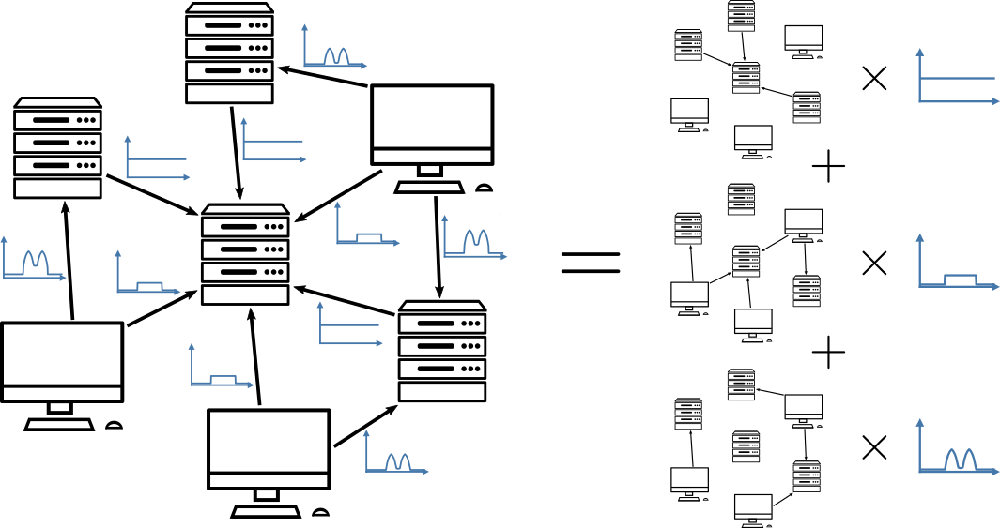

# A Source Separation Approach to Temporal Graph Modelling for Computer Networks



This repository contains the code associated with our paper
"A source separation approach to temporal graph modelling for computer
networks".
It enables reproduction of the experiments presented in the paper,
including data preprocessing and analysis of the results.

### Contents

There are four main directories:

* `code`: implementation of the SNMF model,
  and Python script enabling its application to CSV-formatted datasets.
* `data`: preprocessing scripts for the datasets used in our experiments.
* `results`: compressed JSON file containing the detailed evaluation
  metrics computed in our quantitative experiments.
* `notebooks`: Jupyter notebooks designed to help explore and
  understand the experiment results.

### Setup and requirements

The code is written in Python 3.9.
To install the necessary dependencies:
```
pip install -r requirements.txt
```
This is sufficient for running the model using the NumPy backend.
To use the PyTorch backend (including GPU support), you also need to
install [torch](https://pytorch.org/get-started/locally/) and
[torch-sparse](https://pypi.org/project/torch-sparse/).

### Usage

The `experiments.sh` script reproduces the experiments presented in
the paper.
To reuse the model in other settings, all necessary classes can be
found in `snmf.py`.
